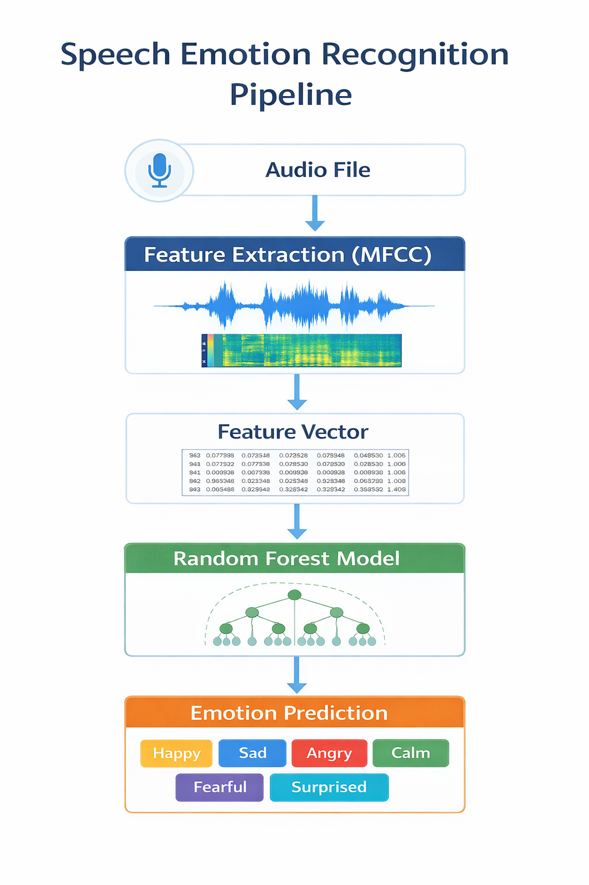
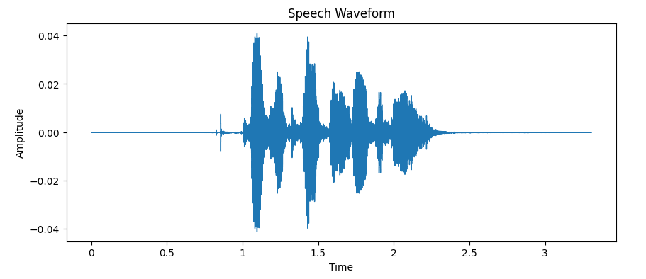
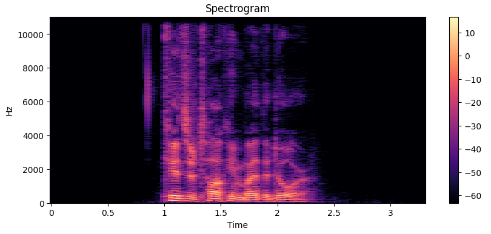
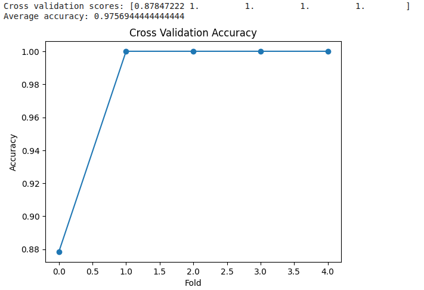
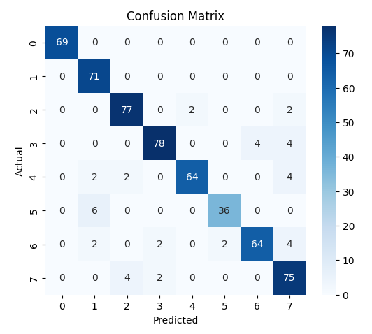
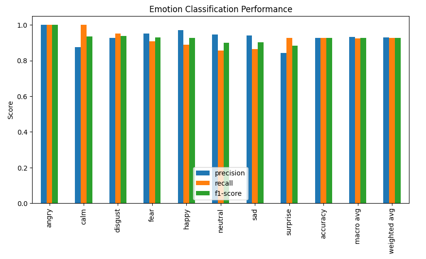

# 🎤 Speech Emotion Recognition using Machine Learning

Detect human emotions from speech using **MFCC feature extraction** and a **Random Forest classifier** trained on the RAVDESS dataset.


This project detects **human emotions from speech audio** using **Machine Learning**.

The system analyzes speech signals, extracts audio features, and uses a **Random Forest classifier** to predict emotions such as:

- 😊 Happy
- 😢 Sad
- 😠 Angry
- 😌 Calm
- 😨 Fearful
- 😲 Surprised

> Speech Emotion Recognition combines **audio signal processing** with **machine learning classification techniques** to identify emotions expressed in speech.

---

## 📌 Project Pipeline

Steps involved:

1. Audio input is collected from speech datasets
2. Audio signals are preprocessed and analyzed
3. MFCC features are extracted from audio signals
4. Feature vectors are used to train a Random Forest classifier
5. The trained model predicts the emotion in the speech audio



---

## 📊 Audio Signal Visualization

### Waveform

The waveform represents how the **amplitude of the speech signal changes over time**.



### Spectrogram

A spectrogram shows how the **frequency components of the audio signal vary with time**.



> Spectrograms help visualize the structure of speech signals, allowing machine learning models to capture emotional characteristics.

---

## 🧠 Feature Extraction

For audio processing, we use the **LibROSA** library.

### MFCC (Mel Frequency Cepstral Coefficients)

MFCC features capture the **characteristics of the human vocal tract**, making them highly effective for speech and emotion recognition.

**Feature extraction process:**

1. Load audio using `librosa`
2. Normalize audio length
3. Extract MFCC features
4. Convert audio signals into numerical feature vectors
5. Store extracted features for machine learning training

---

## 🤖 Model Used

We use a **Random Forest Classifier** for emotion classification.

**Why Random Forest?**

| Advantage | Description |
|-----------|-------------|
| High Dimensionality | Handles high-dimensional data effectively |
| Overfitting | Reduces overfitting through ensemble learning |
| Classification | Works well for multi-class classification problems |
| Interpretability | Robust and easy to interpret |
| Small Datasets | Provides strong performance on small datasets |

> Random Forest works by combining multiple **decision trees** to produce a final prediction.

---

## 📈 Model Performance

### Cross Validation Accuracy



**Average Accuracy: ~97.5%**

> Cross validation helps measure how well the model performs on unseen data.

### Confusion Matrix



> Diagonal values represent correct predictions while off-diagonal values indicate misclassifications.

### Emotion Classification Performance



> This chart shows the **precision, recall, and F1-score** for each emotion class.

---

## 📂 Dataset

The project uses the **RAVDESS Speech Emotion Dataset**.

- 🎙️ **1440** speech audio files
- 👥 **24 actors** (12 male and 12 female)
- 🎭 **8 different emotions**

### Emotion Labels

| Code | Emotion |
|------|---------|
| 01 | Neutral |
| 02 | Calm |
| 03 | Happy |
| 04 | Sad |
| 05 | Angry |
| 06 | Fear |
| 07 | Disgust |
| 08 | Surprise |

> Each audio filename encodes the emotion label, making it easy to extract labels programmatically.

---

## 🛠 Technologies Used

| Technology | Purpose |
|------------|---------|
| Python | Core programming language |
| LibROSA | Audio signal processing |
| Scikit-Learn | Machine learning model |
| NumPy | Numerical computing |
| Pandas | Data manipulation |
| Matplotlib | Data visualization |
| Seaborn | Statistical visualization |
| Google Colab | Cloud-based notebook environment |

---

## 📦 Project Structure

```
Speech-Emotion-Recognition/
│
├── images/
│   ├── accuracy_graph.png
│   ├── confusion_matrix.png
│   ├── emotion_accuracy.png
│   ├── pipeline_diagram.png
│   ├── spectrogram.png
│   └── waveform.png
│
├── emotion_detection.ipynb
├── emotion_model.pkl
├── predictions.csv
├── requirements.txt
└── README.md
```

---

## 🚀 How to Run the Project

### 1️⃣ Clone the repository

```bash
git clone https://github.com/shravaniM30/Speech-Emotion-Analyzer.git
cd Speech-Emotion-Recognition
```

### 2️⃣ Install dependencies

```bash
pip install -r requirements.txt
```

### 3️⃣ Run the notebook

Open the notebook and run all cells:

```
emotion_detection.ipynb
```

Train the model and run the prediction cells.

---

## 🌍 Applications

Speech Emotion Recognition has many real-world use cases:

- 📞 Customer sentiment analysis
- 🧠 Mental health monitoring
- 🤖 Human-robot interaction
- 🎙️ Smart voice assistants
- 🚗 Automotive driver monitoring systems
- 📊 Call center analytics

---

## 📜 Conclusion

This project demonstrates how **machine learning** and **audio signal processing** can be combined to detect emotions from speech.

The model successfully classifies emotions using **MFCC features** and **Random Forest classification**.

**Future improvements may include:**

- Using deep learning models (CNN, LSTM)
- Increasing dataset size
- Real-time emotion detection
- Building a web interface for live prediction

---

## 👩‍💻 Author

**Shravani Nagesh Mhetre**

*Machine Learning | Audio Processing | Speech Emotion Recognition*

---

<p align="center">⭐ If you found this project helpful, please give it a star!</p>
